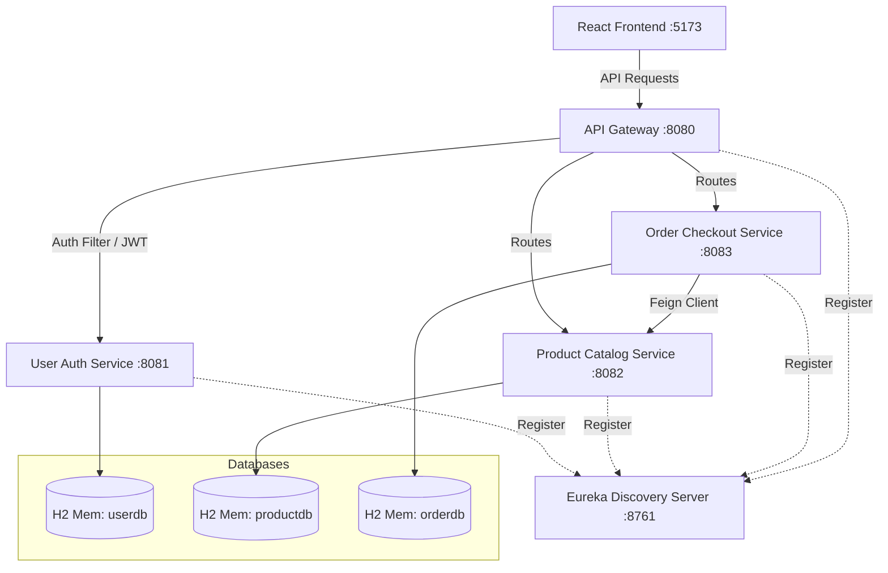

# Cartify - Premium Microservices E-Commerce System

Cartify is an enterprise-grade, microservices-based e-commerce platform built using **Spring Boot**, **Spring Cloud**, **React (Vite)**, and **Vanilla CSS** with a custom light glassmorphism aesthetic. 

The system is designed to simulate a real-world production environment with service registry, API gateway routing, inter-service Feign communication, transaction control, database-per-service isolation, and circuit breaker fault tolerance.

---

## 🏗️ Architecture Blueprint



---

## ⚡ Tech Stack & Core Features

### 1. Frontend (`/frontend`)
*   **Vite + React**: Core logic using modern state management hooks.
*   **Custom Glassmorphism UI**: Beautiful light-theme styled with HSL cherry accents (`#c9184a`). No Tailwind dependencies for high customizability.
*   **Auto-Open Cart Panel**: Adds items with immediate drawer slide animations.
*   **In-Cart Shipping Address**: Validate and enter addresses before checkout.
*   **Admin Dashboard**: Manage inventory levels and add products to the catalog dynamically.

### 2. Backend (`/backend`)
*   **API Gateway (`gateway-service` :8080)**: Central entryway. Evaluates JWT tokens and injects parsed user claims (`X-User-Id`, `X-User-Role`) downstream. Supports global CORS.
*   **User Service (`user-service` :8081)**: Manages authentication, token issuance (BCrypt + JWT), and registration. Seeds two test accounts (`customer` / `admin`).
*   **Product Service (`product-service` :8082)**: Manages catalog and stock. Seeds **100+ unique products** with Indian Rupee (`₹`) pricing.
*   **Order Service (`order-service` :8083)**: Coordinates checkout. Uses **OpenFeign** for inter-service stock checks and deduction.
*   **Fault Tolerance (Resilience4j)**: Custom circuit breakers in the order service handle catalogue offline states gracefully with fallback responses.
*   **Eureka Discovery (`discovery-service` :8761)**: Dynamic service registration and lookup.

---

## 🔌 Port Mapping Registry

| Service | Port | Database Name | Description |
| :--- | :---: | :---: | :--- |
| **API Gateway** | `8080` | *None* | Centralized endpoint router & security filter |
| **User Service** | `8081` | `userdb` | Authentication & profile registry |
| **Product Service** | `8082` | `productdb` | Catalog items & live inventory levels |
| **Order Service** | `8083` | `orderdb` | Shopping cart processing & order creation |
| **Eureka Server** | `8761` | *None* | Central microservice registration directory |
| **React Frontend** | `5173` | *None* | Client interface |

---

## 🚀 Getting Started

### Prerequisites
*   **Java 24+** (Recommended) or Java 17+
*   **Node.js 18+** & npm
*   **Maven** (Included in maven-wrapper)

### Setup & Startup

1.  **Build the Backend Modules**:
    Navigate to the `backend/` folder and run Maven package to compile all Spring Boot modules:
    ```bash
    cd backend
    ./mvnw clean package -DskipTests
    cd ..
    ```

2.  **Install Frontend Dependencies**:
    Navigate to the `frontend/` folder and run npm install:
    ```bash
    cd frontend
    npm install
    cd ..
    ```

3.  **Run the System**:
    Execute the parent PowerShell script to launch all microservices and the React dev server in individual terminals automatically:
    ```powershell
    ./start-all.ps1
    ```

4.  **Test Accounts**:
    *   **Customer Role**: Username: `customer` / Password: `password`
    *   **Admin Role**: Username: `admin` / Password: `password`
